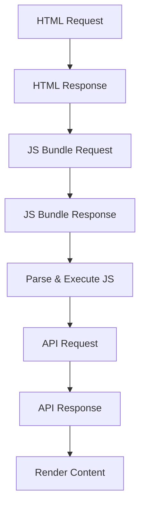

# Investigate This App 🔍

### A Traditional React E-commerce App

Before we dive into React's limitations, let's explore a real React SPA together.

**Try these things:**
- View the page source (Right-click → View Page Source)
- Check the Network tab in DevTools
- Notice the initial load time
- Try refreshing on a product page

<div class="mt-4">

### 🔗 [GitHub Repo](https://github.com/chetra-seng/fake-shop.git)

</div>

::right::

<div class="h-full flex items-center justify-center">
  
</div>

---

# React App: Initial Load 🔄

What happens when a user visits your React app?

Let's break down each step...

---

# Step 1: Browser Requests HTML 📥

User types URL or clicks a link → Browser fetches HTML from server

```html
<!-- What the server sends back -->
<!DOCTYPE html>
<html>
  <head>
    <title>My React App</title>
    <link rel="stylesheet" href="/static/css/main.css">
  </head>
  <body>
    <div id="root"></div>  <!-- 👈 Empty! No content here -->
    <script src="/static/js/bundle.js"></script>
  </body>
</html>
```

<v-click>

**What the user sees:** ⬜ Blank white screen!

</v-click>

---

# Step 2: Browser Downloads JavaScript Bundle 📦

The browser finds the `<script>` tag and starts downloading

```bash
# Typical React app bundle sizes
main.js         450 KB   (your app code)
vendor.js       350 KB   (React, React-DOM, libraries)
chunk1.js       120 KB   (lazy loaded routes)
chunk2.js        80 KB   (more lazy loaded code)
─────────────────────────
Total:        1,000 KB   (1 MB to download!)
```

<v-click>

**On slow 3G connection:** This takes 8-10 seconds! 🐌

</v-click>

---

# Step 3: JavaScript Executes ⚙️

Once downloaded, the browser must parse and execute the JavaScript

```jsx
// React needs to:
import React from 'react';           // Load React library
import ReactDOM from 'react-dom';    // Load ReactDOM
import App from './App';             // Load your app
import './index.css';                // Load styles

// Finally, mount the app
ReactDOM.createRoot(
  document.getElementById('root')
).render(<App />);
```

<v-click>

**What happens:** React initializes, components are created in memory

**What user sees:** Still blank! ⬜

</v-click>

---

# Step 4: Component Mounts & useEffect Runs 🎬

Now React renders your component, but wait... we need data!

```jsx
function ProductsPage() {
  const [products, setProducts] = useState([]);
  const [loading, setLoading] = useState(true);  // 👈 Still loading!

  useEffect(() => {
    // This runs AFTER the component mounts
    fetch('/api/products')
      .then(res => res.json())
      .then(data => {
        setProducts(data);
        setLoading(false);
      });
  }, []);

  if (loading) return <Spinner />;  // 👈 User sees this first!
  return <ProductList products={products} />;
}
```

<v-click>

**What user sees:** Loading spinner... 🔄

</v-click>

---

# Step 5: API Request & Response 📡

The fetch request travels to your backend API

```
Browser                          Server
   │                               │
   │──── GET /api/products ───────>│
   │                               │  Query database
   │                               │  Process data
   │                               │  Build response
   │<──── JSON Response ───────────│
   │                               │

Time: 200-500ms (or more!)
```

<v-click>

```json
// Response received
{
  "products": [
    { "id": 1, "name": "iPhone", "price": 999 },
    { "id": 2, "name": "MacBook", "price": 1299 }
  ]
}
```

</v-click>

---

# Step 6: Finally! Content Renders 🎉

React updates state → triggers re-render → user sees content

```jsx
function ProductsPage() {
  const [products, setProducts] = useState([]);
  const [loading, setLoading] = useState(true);

  // ... fetch logic ...

  if (loading) return <Spinner />;

  // ✅ Finally renders with data!
  return (
    <div className="products-grid">
      {products.map(product => (
        <ProductCard key={product.id} product={product} />
      ))}
    </div>
  );
}
```

**User finally sees the products!** 🛍️

---

# The Complete Timeline ⏱️

```
0ms      → User clicks link
100ms    → HTML received (empty!)
500ms    → JS bundle downloaded
800ms    → JavaScript parsed & executed
850ms    → React initialized & mounted
900ms    → useEffect runs, API call starts
1200ms   → API response received
1250ms   → State updates, re-render triggered
1300ms   → ✅ Content finally visible!
```

<v-click>

<div class="mt-8 p-4 bg-red-500/20 rounded-lg">

**Total wait time: 1.3+ seconds** (on a fast connection!)

On slow 3G: **8-15 seconds** of staring at a blank screen 😱

</div>

</v-click>

---

# Limitation #1: SEO Problems

## Search Engine Crawlers See This:

```html
<html>
  <body>
    <div id="root"></div>
    <script src="bundle.js"></script>
  </body>
</html>
```

<v-clicks>

- **No content** to index
- **No meta tags** for social sharing
- **No structured data**
- Poor rankings in search results
- No rich previews on social media

</v-clicks>

---

# Limitation #2: Performance Issues

<div class="grid grid-cols-2 gap-4">

<div>

## Bundle Size Problems

```bash
# Typical React app bundles
main.bundle.js      450 KB
vendor.bundle.js    800 KB
--------------------------------
Total First Load:   1.25 MB
```

**Impact:**
- Slow initial page load
- High data usage
- Poor mobile experience

</div>

<div>

## Loading Waterfalls



Each step waits for the previous one!

</div>

</div>

---

# Limitation #3: Client-Side Routing

```tsx
// React Router setup
import { BrowserRouter, Routes, Route } from 'react-router-dom';

function App() {
  return (
    <BrowserRouter>
      <Routes>
        <Route path="/" element={<Home />} />
        <Route path="/products" element={<Products />} />
        <Route path="/products/:id" element={<ProductDetail />} />
      </Routes>
    </BrowserRouter>
  );
}
```

<v-clicks>

**Problems:**
- All routes in one JavaScript bundle
- No automatic code splitting
- Direct URL access requires server configuration
- 404 pages need special handling

</v-clicks>

---

# Limitation #4: Data Fetching

```tsx
function ProductPage({ productId }) {
  const [product, setProduct] = useState(null);
  const [loading, setLoading] = useState(true);
  const [error, setError] = useState(null);

  useEffect(() => {
    setLoading(true);
    fetch(`/api/products/${productId}`)
      .then(res => res.json())
      .then(data => {
        setProduct(data);
        setLoading(false);
      })
      .catch(err => {
        setError(err);
        setLoading(false);
      });
  }, [productId]);

  if (loading) return <Spinner />;
  if (error) return <Error />;
  return <ProductDetails product={product} />;
}
```

Always fetch on the client, after JavaScript loads!

---

# Limitation #5: API Security

```tsx
// ⚠️ Exposed API keys in React
const API_KEY = 'sk_live_51H...'; // Visible in browser!

function Dashboard() {
  useEffect(() => {
    fetch('https://api.stripe.com/charges', {
      headers: {
        'Authorization': `Bearer ${API_KEY}` // ❌ Exposed!
      }
    });
  }, []);
}
```

<v-clicks>

**Problems:**
- API keys exposed in client code
- No server-side security
- Can't use server-only libraries
- CORS complexities

</v-clicks>

---

# Limitation #6: Static Export Limitations

```bash
# React build output
npm run build

# Creates:
build/
  static/
    js/
      main.abc123.js
    css/
      main.def456.css
  index.html  # Only ONE HTML file!
```

<v-clicks>

- Cannot pre-render different pages
- All pages share the same HTML shell
- No per-page optimization
- No true static site generation

</v-clicks>

---

# Limitation #7: Code Organization

```
src/
  components/
    Button.tsx
    Header.tsx
  pages/
    Home.tsx
    Products.tsx
  routing/
    routes.tsx
  api/
    products.ts
    users.ts
```

<v-clicks>

- Manual route configuration
- Separate API and frontend code
- No co-location of related code
- Harder to maintain at scale

</v-clicks>

---

# Limitation #8: Image Optimization

```tsx
// React - Manual optimization

```

<v-clicks>

**You need to manually:**
- Resize images
- Generate different formats (WebP, AVIF)
- Create responsive variants
- Implement lazy loading
- Handle loading states
- Optimize for different devices

</v-clicks>

---

# Summary: React Limitations

<div class="grid grid-cols-2 gap-4">

<div>

## Performance
- Large JavaScript bundles
- Client-side rendering only
- Loading waterfalls
- No automatic code splitting

## SEO
- Empty initial HTML
- No server-side rendering
- Poor social media previews
- Limited meta tag control

</div>

<div>

## Developer Experience
- Manual routing setup
- Complex data fetching
- No API routes
- Manual image optimization
- Exposed secrets risk

## Scale
- No automatic optimizations
- Manual performance tuning
- Complex deployment setup

</div>

</div>
